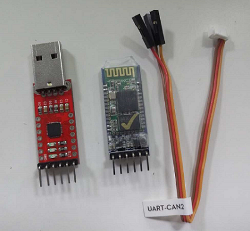

#DJI Onboard STM32 例程
##简介
本工程使用stm32f407Discovery开发板测试，使用Keil uVision5编译。使用串口和开发板通信，发送指令。  
采用四线串口协议，如果PC上没有串口，建议使用USB转串口模块，如MAX232、PL2303、CP2102等
在使用本例程前请确认你已经**仔细阅读过**有关OnboardSDK的**[所有文档](https://developer.dji.com/cn/onboard-sdk/documentation/ProgrammingGuide/)**
##目录
1. [硬件接口](#硬件接口)
2. [开始使用](#开始使用)
   + [操作步骤](#操作步骤)
   + [指令格式](#指令格式)
   + [发送指令的顺序](#发送指令的顺序)
3. [动画示范](#动画示范)  

----------

##硬件接口
  使用USART2作为Debug通道。端口为PB10，PB11分别对应USART2的TX、RX，波特率为**115200**，此处的波特率必须和串口调试助手的波特率**一致**；  
使用USART3作为和M100上的N1飞控通信的接口。端口为PA2、PA3分别对应USART3的TX、RX，和N1飞控的“USART_CAN2”端口连接。波特率为 **921600**.此处的波特率必须和N1飞控的波特率**一致**，可以在DJI调参软件中调整；

##开始使用
>第一次使用前请连接手机和遥控器，并按照官网提示激活飞机。[更多关于激活](https://developer.dji.com/cn/onboard-sdk/documentation/ActivationGuide/)  
第一次激活后可以使用虚拟遥控功能替代实体遥控器  

###操作步骤
1. 将M100上电（**注意，测试时请将螺旋桨拆下**）

2. 待M100启动后将stm32与之连接。由于M100没有提供3/5V电源接口，**请自行给stm32供电**。

3. 用串口将PC和stm32连接起来，建议购入usb延长线、各种无线透传模块，方便调试。  

本例程中所有通信方式都**已经设置为不加密**，如果需要加密，请自行配置。

硬件正确配置后，复位stm32。如果一切正常，你将会看到M100发送回来的版本信息，此时可以向M100发送测试指令

###指令格式
---
一帧指令由帧头，指令集，指令，数据(可选),帧尾 构成;  
第一第二个字节为帧头，固定为0xFA 0xFB。
第三、第四个字节为指令。
中间可能会有数据字节，
最后一个字节为帧结束字节。

---
单片机接收到帧结束字节0xFE后会立即开始一次命令响应。

注意：这里所指的指令是PC向stm32发送的命令，发送时请勾选**Hex发送**而不是ASCII发送。M100发回来的调试信息也会发送到
PC上，所以在PC上的串口调试助手中**发送端选择HEX发送**，**接收端选择ASCII接收**，波特率为115200

例如：0xFA 0xFB 0x02 0x01 0xFE

已经支持的命令如下，需要更多指令请自行添加

|指令内容           | 指令代码             |
|:-----------------|:------------------|  
| 获取当前版本信息   | 0xFA 0xFB 0x00 0xFE |
|发送激活指令 		| 0xFA 0xFB 0x01 0xFE | 
|请求控制权   		|0xFA 0xFB 0x02 0x01 0xFE|  
|释放控制权   	 	|0xFA 0xFB 0x02 0x00 0xFE | 
|解锁电机   		 	|0xFA 0xFB 0x03 0x01 0xFE|  
|锁定电机  		 	|0xFA 0xFB 0x03 0x00 0xFE|  
|一键返航  		 	|0xFA 0xFB 0x05 0x01 0xFE|  
|一键起飞  		 	|0xFA 0xFB 0x05 0x02 0xFE|  
|一键降落  		 	|0xFA 0xFB 0x05 0x03 0xFE|  
|虚拟遥控开启（A档） |0xFA 0xFB 0x06 0x01 0xFE  |
|虚拟遥控开启（F档） |0xFA 0xFB 0x06 0x02 0xFE  |
|虚拟遥控关闭 	 	|0xFA 0xFB 0x06 0x00 0xFE | 
|开启热点功能 	 	|0xFA 0xFB 0x07 0x00 0xFE (参数已经预设,可以根据需要在程序中调整)| 
航点功能需自己输入参数 具体参见官方文档
这里给出一份样例

0xFA 0xFB 0x04 0x01 0x91 0x00 0x00 0x00 0x00 0x00 0x20 0x00 0x00 0xFE

其中 0x04 0x01为选择航点模式   
0x91 为模式标志字节  选择的模式为*VERT_POS* ，*HORI_POS* ，*YAW_RATE*， *Ground系* ，*增稳模式*  

+ 0x00 0x00 为X方向距离为0   
- 0x00 0x00 为Y方向距离为0  
- 0x01 0xf4 为Z方向距离为5.00m  
+ 0x00 0x00 为YAW方向不旋转  

*注意:HORI_POS模式的输入量是相对位置的净输入量。净输入量通过GPS或Guidance等传感器获得位置移动的反馈信息，与输入作差后得到。
     为完成飞行的位置控制，需要连续获得反馈并发送该命令，以达到平稳的控制效果。*

---  
###发送指令的顺序
指令的发送是有顺序的

正确的顺序如下

如果使用了虚拟遥控，在正常飞行中物理遥控器**不能控制飞机**。程序中可以选择失去虚拟遥控信号1s后 *降落* 或者 *切换到物理遥控*。  
本例程中选择了失去虚拟遥控后直接降落模式。   

---
##动画示范
下面这个小动画演示了 读取版本信息->激活->打开虚拟遥控A档->虚拟遥控F档->获取控制权->一键起飞->打开热点功能->一键返航->关闭虚拟遥控功能。的过程
